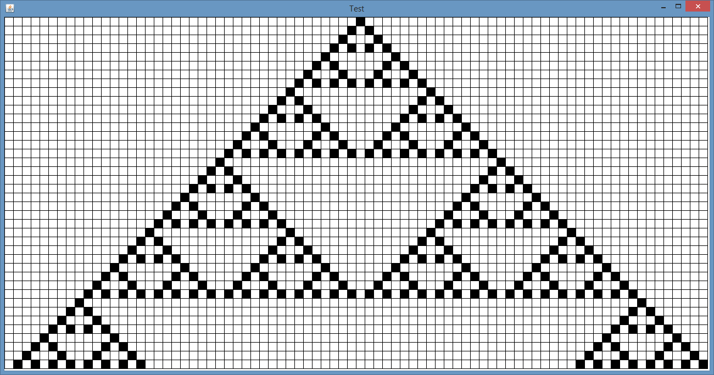
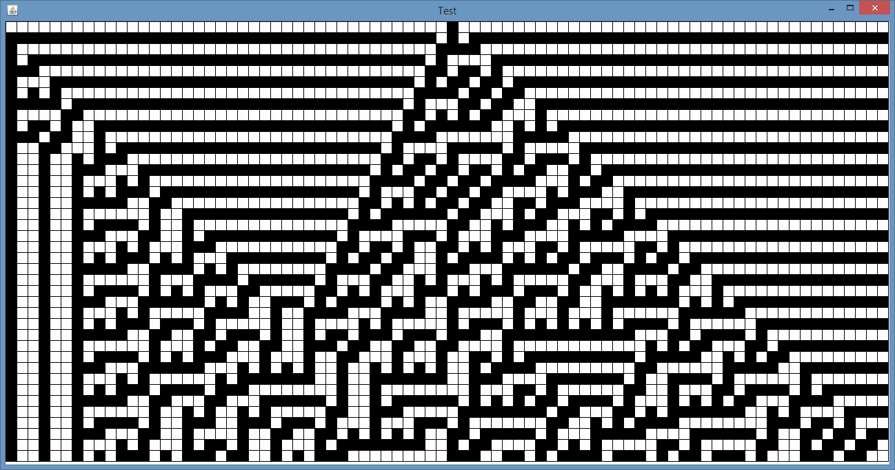
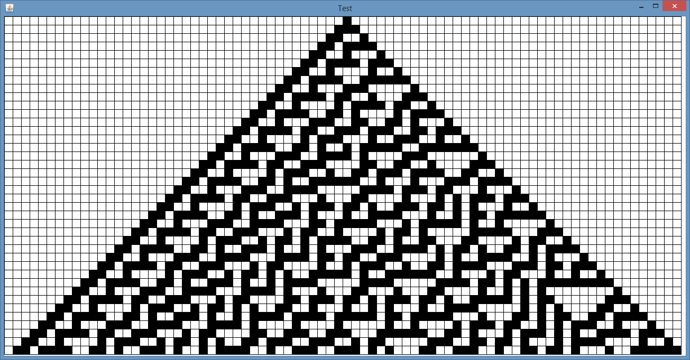
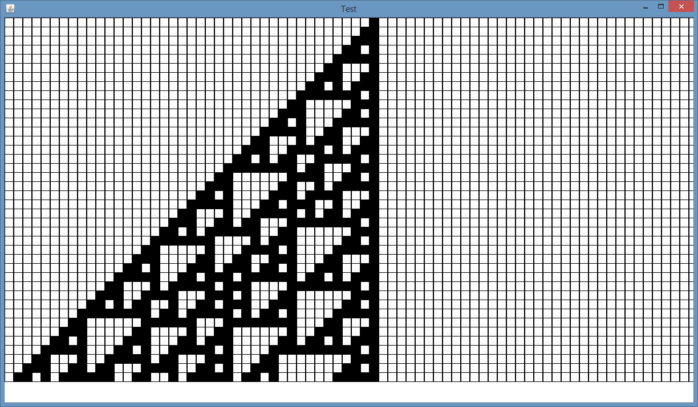

CA-Engine
=========

Simple generator of [Cellular Automata](https://en.wikipedia.org/wiki/Cellular_automaton) (CA) Patterns in Java 

Some Examples of [Cellular Automata](https://en.wikipedia.org/wiki/Cellular_automaton) that I created with this tool.  
     
     
     
     
